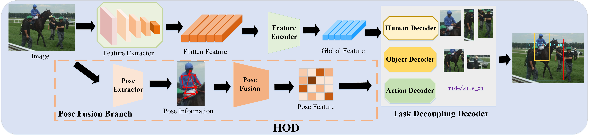

# HOD
Code for our ICME 2023 paper "**HOD: Human-Object Decoupling Network for HOI Detection**".

Contributed by Hantao Zhang, Shouhong wan, Weidong guo, peiquan jin, and Mingguang zheng.



## Installation
Installl the dependencies.
```
pip install -r requirements.txt
```
## Data preparation

### HICO-DET
HICO-DET dataset can be downloaded [here](https://drive.google.com/open?id=1QZcJmGVlF9f4h-XLWe9Gkmnmj2z1gSnk). After finishing downloading, unpack the tarball (`hico_20160224_det.tar.gz`) to the `data` directory.

Instead of using the original annotations files, we use the annotation files provided by the PPDM authors. The annotation files can be downloaded from [here](https://drive.google.com/open?id=1WI-gsNLS-t0Kh8TVki1wXqc3y2Ow1f2R). The downloaded annotation files have to be placed as follows.
```
data
 └─ hico_20160224_det
     |─ annotations
     |   |─ trainval_hico.json
     |   |─ test_hico.json
     |   └─ corre_hico.npy
     :
```

### V-COCO
First clone the repository of V-COCO from [here](https://github.com/s-gupta/v-coco), and then follow the instruction to generate the file `instances_vcoco_all_2014.json`. Next, download the prior file `prior.pickle` from [here](https://drive.google.com/drive/folders/10uuzvMUCVVv95-xAZg5KS94QXm7QXZW4). Place the files and make directories as follows.
```
GEN-VLKT
 |─ data
 │   └─ v-coco
 |       |─ data
 |       |   |─ instances_vcoco_all_2014.json
 |       |   :
 |       |─ prior.pickle
 |       |─ images
 |       |   |─ train2014
 |       |   |   |─ COCO_train2014_000000000009.jpg
 |       |   |   :
 |       |   └─ val2014
 |       |       |─ COCO_val2014_000000000042.jpg
 |       |       :
 |       |─ annotations
 :       :
```
For our implementation, the annotation file have to be converted to the HOIA format. The conversion can be conducted as follows.
```
PYTHONPATH=data/v-coco \
        python convert_vcoco_annotations.py \
        --load_path data/v-coco/data \
        --prior_path data/v-coco/prior.pickle \
        --save_path data/v-coco/annotations
```
Note that only Python2 can be used for this conversion because `vsrl_utils.py` in the v-coco repository shows a error with Python3.

V-COCO annotations with the HOIA format, `corre_vcoco.npy`, `test_vcoco.json`, and `trainval_vcoco.json` will be generated to `annotations` directory.


## Pre-trained model
Download the pretrained model of DETR detector for [ResNet50](https://dl.fbaipublicfiles.com/detr/detr-r50-e632da11.pth), and put it to the `params` directory.
## Training
After the preparation, you can start training with the following commands.

```
PYTHONUNBUFFERED=1;CUDA_VISIBLE_DEVICES=0,1,2,3,4,5,6,7 \
python -m torch.distributed.launch \
--nproc_per_node=8 \
--use_env main.py \
--pretrained params/detr-r50-pre-2stage-q64.pth \
--output_dir logs \
--dataset_file hico \
--hoi_path data/hico_20160224_det \
--num_obj_classes 80 \
--num_verb_classes 117 \
--num_hoi_classes 600 \
--backbone resnet50 \
--num_queries 64 \
--dec_layers_hopd 3 \
--dec_layers_interaction 3 \
--epochs 90 \
--lr_drop 60 \
--use_nms_filter
```

## Evaluation

### HICO-DET
You can conduct the evaluation with trained parameters for HICO-DET as follows.
```
PYTHONUNBUFFERED=1;CUDA_VISIBLE_DEVICES=0,1,2,3,4,5,6,7 \
python -m torch.distributed.launch \
--nproc_per_node=8
--use_env main.py
--pretrained logs/checkpoint_best.pth 
--dataset_file hico 
--hoi_path data/hico_20160224_det 
--num_obj_classes 80 
--num_verb_classes 117 
--backbone resnet50 
--num_queries 64 
--dec_layers_hopd 3
--dec_layers_interaction 3
--eval --use_nms_filter
```

## License
HOD is released under the MIT license. See [LICENSE](./LICENSE) for additional details.

## Acknowledge
Some of the codes are built upon [PPDM](https://github.com/YueLiao/PPDM), [DETR](https://github.com/facebookresearch/detr), [QPIC](https://github.com/hitachi-rd-cv/qpic) and [CDN](https://github.com/YueLiao/CDN). Thanks them for their great works!

